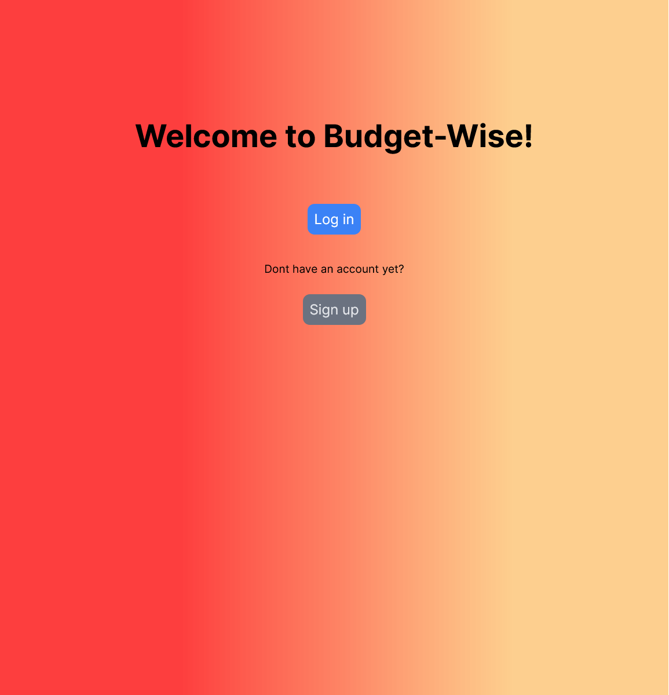

<a name="readme-top"></a>

<!-- TABLE OF CONTENTS -->

# 📗 Table of Contents

- [📖 About the Project](#about-project)
  - [🛠 Built With](#built-with)
    - [Tech Stack](#tech-stack)
    - [Key Features](#key-features)
- [💻 Getting Started](#getting-started)
  - [Setup](#setup)
  - [Prerequisites](#prerequisites)
  - [Install](#install)
  - [Usage](#usage)
  - [Run tests](#run-tests)
  - [Deployment](#deploy)
- [👥 Authors](#authors)
- [🔭 Future Features](#future-features)
- [🤝 Contributing](#contributing)
- [⭐️ Show your support](#support)
- [🙏 Acknowledgements](#acknowledgements)
- [📝 License](#license)

<!-- PROJECT DESCRIPTION -->

# 📖 Budget-Wise🍜<a name="about-project"></a>

> The Budget-Wise app is a great application to plan your expenses. You can sign up and start generating your transactions and budgets



## 🛠 Built With <a name="built-with"></a>

### Tech Stack <a name="tech-stack"></a>

> Here are List of technologies used on this project

<details>
  <summary>Languages</summary>
  <ul>
    <li><a href="https://ruby-lang.org/en">Ruby</a></li>
    <li><a href="https://javascript.com/">JavaScript</a></li>
    <li><a href="https://html.spec.whatwg.org/multipage/">HTML</a></li>
    <li><a href="https://www.w3.org/TR/CSS/#css">CSS</a></li>
  </ul>
</details>

<details>
  <summary>Framework</summary>
  <ul>
    <li><a href="https://rubyonrails.org/">Ruby on Rails</a></li>
  </ul>
</details>

<details>
<summary>Database</summary>
  <ul>
    <li><a href="https://www.postgresql.org/">PostgreSQL</a></li>
  </ul>
</details>

<details>
<summary>Linters</summary>
  <ul>
    <li><a href="https://www.rubocop.org/">Rubocop</a></li>
    <li><a href="https://www.stylelint.io/">Stylelint</a></li>
  </ul>
</details>

<details>
<summary>Test library</summary>
  <ul>
    <li><a href="https://www.rspec.info/">Rspec</a></li>
  </ul>
</details>

<!-- Features -->

### Key Features <a name="key-features"></a>

- Create budget
- Generate transactions
- Keeps track of all your expenses

<p align="right">(<a href="#readme-top">back to top</a>)</p>

## 💻 Getting Started <a name="getting-started"></a>

### Prerequisites

In order to run this project you need:

- Ruby installed on your computer

### Setup

Clone this repository to your desired folder:

```
  git clone https://github.com/TracyMuso/Budget-Wise.git
```

change directory to cloned folder

```
  cd Budget-Wise
```

### Install

Install project dependecies with:

```
  bundle install
```

### Tests <a name="run-tests"></a>
```
   rspec
```

 ### Deployment <a name="deploy"></a>

 <!-- - [Live demo](https://budegt.onrender.com) -->
 - [Presentation video](https://www.loom.com/share/d0c4697e9e1b409884b1985bad587bd4)

### Usage

To run the project, execute the following command:

```
  rails server
```

- After running `rails server`, open your browser and enter this address http://localhost:3000/

- Congratulations! your're running **_Budget_Wise_**

<p align="right">(<a href="#readme-top">back to top</a>)</p>

<!-- AUTHORS -->

## 👥 Authors <a name="authors"></a>

👤 **Tracy Musongole**

- GitHub: [@TracyMuso](https://github.com/TracyMuso)
- LinkedIn: [Tracy Musongole](https://www.linkedin.com/in/tracy-muso/)


<p align="right">(<a href="#readme-top">back to top</a>)</p>

<!-- FUTURE FEATURES -->

## 🔭 Future Features <a name="future-features"></a>

> These features will be added in future updates. ⬇️⬇️

- [ ] **Controllers specs**
- [ ] **Processing data in models**
- [ ] **Add api endpoint for generating groups and categories**

<p align="right">(<a href="#readme-top">back to top</a>)</p>

<!-- CONTRIBUTING -->

## 🤝 Contributing <a name="contributing"></a>

Contributions, issues, and feature requests are welcome!

Feel free to check the [issues page](github.com/TracyMuso/Budget-Wise/issues/).

<!-- SUPPORT -->

## ⭐️ Show your support <a name="support"></a>

If you like👍🏽 this project, give the repository a star ⭐

<p align="right">(<a href="#readme-top">back to top</a>)</p>

<!-- ACKNOWLEDGEMENTS -->

## 🙏 Acknowledgments <a name="acknowledgements"></a>

- Design credit goes to [Gregoire Vella on Behance](https://www.behance.net/gregoirevella)
- I would also like to thank the Microverse community

<!-- LICENSE -->

## 📝 License <a name="license"></a>

This project is [MIT](./LICENSE) licensed.

<p align="right">(<a href="#readme-top">back to top</a>)</p>
